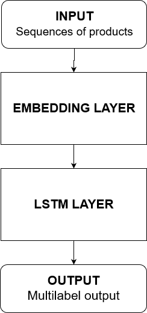

# Odporúèanie produktov v elektronickom obchode

Elektronickı obchod sa stal neoddelite¾nou súèas�ou �ivota takmer ka�dého z nás. V takomto obchode si mo�no dnes be�ne kúpi� tisíce rôznych produktov. Nedá sa teda oèakáva�, �e pou�ívate¾ bude prechádza� všetky produkty a� kım nenájde ten správny. Je tie� dokázané, �e keï pou�ívate¾ do istého okamihu na webovom sídle neobjaví relevantné informácie, odíde. V prípade elektronického obchodu mo�no de facto hovori� o strate zákazníka, ktorı si produkt kúpi u konkurencie.

Pre predajcov je preto k¾úèové zákazníkovi v elektronickom obchode zjednoduši� prechod k produktom, o ktoré by potenciálne mohol ma� záujem. Ide teda o personalizované odporúèanie produktov zákazníkom. Toto sa zvykne rieši� rôznymi odporúèacími algoritmami. Medzi najrozšírenejšie prístupy k odporúèaniu patrí obsahové a kolaboratívne filtrovanie. V poslednıch rokoch sa však ukázalo, �e tento problém mo�no rieši� aj s vyu�itím hlbokıch neurónovıch sietí, ktoré v niektorıch prípadoch dosahujú signifikantne lepšie vısledky ako tradièné prístupy k odporúèaniu.

## Existujúce riešenia
Autori v práci [[1]](https://arxiv.org/abs/1608.07400) ukázali, �e pomocou rekurentnej neurónovej siete je mo�né dosiahnu� lepšie vısledky ako state-of-the-art prístupy pri krátkodobom odporúèaní. Pou�itím LSTM dokázali na základe sekvencie interakcií pou�ívate¾a s polo�kami predikova� jeho nasledujúce interakcie. Metódu overili na dátovıch mno�inách MovieLens 1M a Netflix. Okrem vırazného zlepšenia v krátkodobıch predikciách sa v prípade domény MovieLens podarilo dosiahnu� aj zlepšenie v úplnosti (angl. recall), ktorú mo�no interpretova� ako dlhodobú predikciu. Došlo tie� k vıraznému zvıšeniu diverzity správne odporuèenıch polo�iek (v oboch doménach).

V práci [[2]](https://dl.acm.org/citation.cfm?id=3052569) autori spojili maticovú faktorizáciu a hlbokú neurónovú sie�. Ich model pozostáva z dvoch paralelnıch vetiev, modelov. V jednom modely pomocou neurónovej siete vykonávajú maticovú faktorizáciu a druhı model je hlboká neurónová sie�. Ka�dı model sa predtrénuje samostatne a pri predikcii spoja tieto dva modely vo vıstupnej vrstve. Spojením tıchto dvoch modelov a ich samostatnım predtrénovaním dostali pri experimentoch najlepšie vısledky. Vstupom do modelu je one hot encoding pou�ívate¾a a polo�ky a vıstupom je pravdepodobnos�, �e pou�ívate¾ kúpi danú polo�ku. Metódu overili na dátovıch mno�inách MovieLens 1M a Pinterest..

 
V práci [[3]](https://arxiv.org/abs/1605.09477) pou�ívajú na odporúèanie prístup pomocou neurónovej autoregresie. Tento prístup je podobnı rekurentnej neurónovej sieti. Model na základe toho ako pou�ívate¾ ohodnotil polo�ky vypoèíta rank(oèakávané hodnotenie) všetkıch polo�iek, ktorı pou�ije na vıber polo�iek, ktoré sa budú pou�ívate¾ovi najviac páèi. Model vyhodnocovali na dátovıch mno�inách Netflix, MovieLens 1M a 10M. Pri experimentoch zistili, �e hlbšie neurónové siete dosahujú lepší vısledok.

Kombináciou dlhodobıch a krátkodobıch preferencií pou�ívate¾a získanıch dvomi LSTM neurónovımi sie�ami sa autorom v práci [[4]](https://dl.acm.org/citation.cfm?id=3220014) podarilo prekona� metódu HRNN Init, ktorá bola pova�ovaná za state-of-the-art v úlohe odporúèania nasledujúcej polo�ky. Navrhnutá metóda BINN pozostáva z dvoch hlavnıch komponentov: vnorenie polo�iek (angl. item embedding) a uèenie správania pou�ívate¾a. Prvá èas� predstavuje item2vec obohatenı o zoh¾adnenie frekvencie polo�ky ako váhového faktora. Druhú èas� tvoria dve LSTM siete urèené na zachytenie historicky stabilnıch dlhodobıch preferencií pou�ívate¾a a krátkodobého zámeru pou�ívate¾a v rámci súèasného sedenia. Metóda bola overená na dvoch e-commerce dátovıch mno�inách JD a Tianchi.

## Dátové mno�iny
Na trénovanie a vyhodnotenie modelu budeme pou�íva� dátovú mno�inu, ktorá pozostáva z logov aktivity pou�ívate¾a v elektronickom obchode, teda aké polo�ky si zobrazil, pridal do košíka a ktoré z nich nakúpil.

Z dostupnıch mno�ín sme vybrali dve z prostredia elektronického obchodu. Prvou je Retailrocket, ktorá bola zverejnená na Kaggle a druhou (zálo�nou) je Yoochoose, ktorá bola zverejnená v rámci Recsys Challenge 2015. Jej nevıhodou však je, �e neobsahuje ID pou�ívate¾a ale iba sedenia, èo neumo�òuje skúma� dlhodobé preferencie pou�ívate¾a.

### Retailrocket ([link](https://www.kaggle.com/retailrocket/ecommerce-dataset))
Dátová mno�ina obsahuje súbor s akciami, ktoré pou�ívate¾ vykonal. Akcie sa delia na zobrazenie produktu, vlo�enie produktu do košíka a nákup produktu. Tabu¾ka obsahuje èas vykonania aktivity, ID pou�ívate¾a, ID produktu a typ akcie. K dispozícii je aj súbor, ktorı obsahuje informácie o produktoch - kategóriu, dostupnos� a anonymizované atribúty produktu. Dátová mno�ina obsahuje 2,7 milióna akcii, z toho bolo 69 tisíc pridaní do košíka a a 22 tisíc nákupov.

### Yoochoose ([link](https://2015.recsyschallenge.com/challenge.html))
Táto dátová mno�ina obsahuje dáta o kliknutiach a nákupoch pou�ívate¾ov v elektronickom obchode v rámci jedného sedenia. Je rozdelená do dvoch súborov, pod¾a akcie na kliknutia a nákupy. Tabu¾ka s kliknutiami obsahuje ID sedenia, èas akcie, ID produktu a kategóriu produktu. Tabu¾ka s nákupmi obsahuje ID sedenia, èas akcie, ID produktu, cenu produktu a mno�stvo nakúpeného produktu. Dátová sada obsahuje 9 miliónov sedení, 33 miliónov kliknutí a 1,1 milióna nákupov.

## Návrh

Nako¾ko sa ukázalo, �e kombináciou dlhodobıch a krátkodobıch preferencií je mo�né dosiahnu� zaujímavé vısledky, chceli by sme sa tomuto venova� aj v našej práci.
Mo�nou architektúrou teda sú dve samostatné rekurentné siete (napr. LSTM). Prvá z nich má na vstupe všetky historické interakcie pou�ívate¾a s polo�kami a druhá zoh¾adòuje len poslednıch N akcií (bli�šie urèíme na základe analızy dát a konzultácií). Následne by sme porovnali vısledky dosiahnuté jednotlivımi sie�ami ako aj ich vhodnej kombinácie.

## Návrh modelu

## Zdroje

[1] DEVOOGHT, Robin; BERSINI, Hugues. Collaborative filtering with recurrent neural networks. arXiv preprint arXiv:1608.07400, 2016.

[2] HE, Xiangnan, et al. Neural collaborative filtering. In: Proceedings of the 26th international conference on world wide web. International World Wide Web Conferences Steering Committee, 2017. p. 173-182.

[3] ZHENG, Yin, et al. A neural autoregressive approach to collaborative filtering. arXiv preprint arXiv:1605.09477, 2016.

[4] LI, Zhi, et al. Learning from history and present: Next-item recommendation via discriminatively exploiting user behaviors. In: Proceedings of the 24th ACM SIGKDD International Conference on Knowledge Discovery & Data Mining. ACM, 2018. p. 1734-1743.

